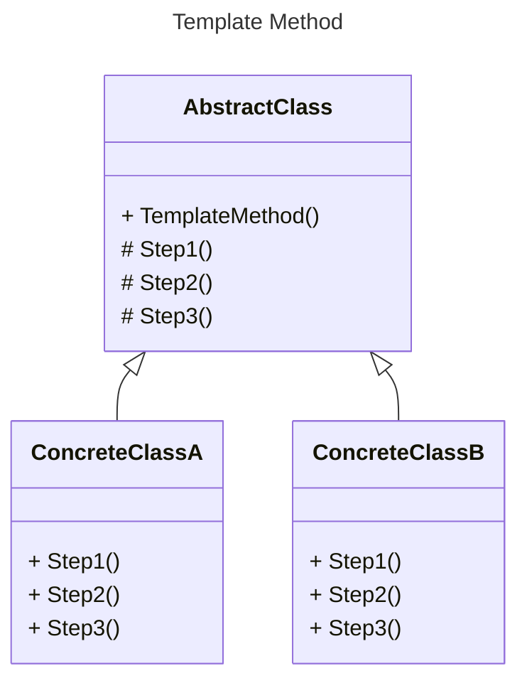
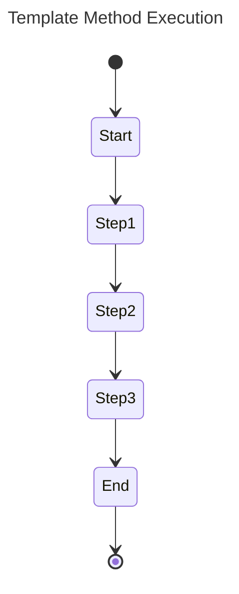

# `Template Method`

### Призначення та застосування шаблону

#### **Template Method** — це поведінковий патерн проєктування, який визначає скелет алгоритму в базовому класі, дозволяючи підкласам змінювати окремі кроки алгоритму без зміни його структури. Це забезпечує повторне використання коду та спрощує підтримку.

###### Template Method корисний, коли потрібно:

- уникнути дублювання коду, зберігаючи гнучкість;
- дозволити підкласам реалізовувати деталі алгоритму без зміни загальної логіки;
- контролювати послідовність виконання кроків алгоритму.

#### **Застосовується :**

- у бібліотеках та фреймворках для надання розширюваних алгоритмів;
- у системах з уніфікованими процесами, де є стандартні кроки з можливістю специфічного налаштування;
- у шаблонних механізмах рендерингу звітів або обробки файлів.

### Діаграми класів та стану

##### Class Diagram Template Method:

##### State Diagram Template Method:

### Опис основних структурних елементів :

- **AbstractClass** - визначає шаблон методу та загальну логіку алгоритму;
- **ConcreteClassA, ConcreteClassB** - реалізують конкретні кроки алгоритму;
- **TemplateMethod()** - визначає послідовність кроків та викликає абстрактні методи, які реалізуються в підкласах.

###### На діаграмі станів показано послідовне виконання кроків шаблонного методу.

### Джерела інформації:

##### - [refactoring.guru](https://refactoring.guru/design-patterns/template-method)

##### - [java-design-patterns.com](https://java-design-patterns.com/patterns/template-method/)

